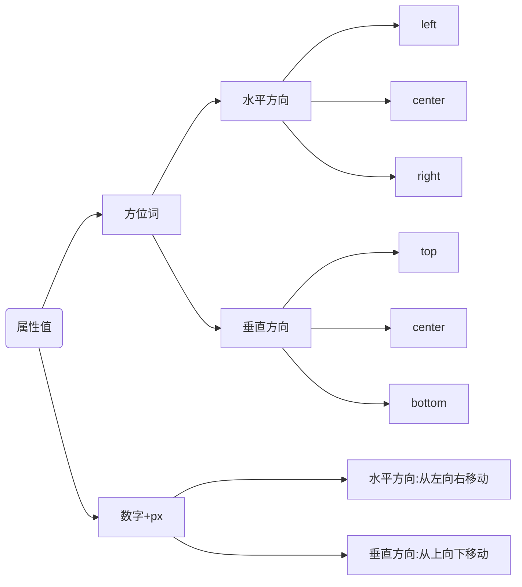

# CSS3快速入门语法

## 一、基本语法

### 1.前言

参考视频：<https://www.bilibili.com/video/BV1Kg411T7t9?p=45>

作用：美化网页、布局页面

语法结构：
选择器{
  属性：属性值；
}

注释 ：  /*这是层叠样式表里面的注释*/

* 内嵌式：在`<style>`标签内书写，`<style>`标签放在`<head>`标签内

* 外联式：写在.css文件中，需要通过`<link>`标签在网页引入

  ```html
  <link rel="stylesheet" href="url">
   ```

* 行内式：写在标签的style属性中

### 2.基础选择器

#### 2.1 标签选择器

```css
标签名{
 属性: 属性值;
}
```

作用：选择某一类标签。

#### 2.2 类选择器

```css
.类名{
 属性：属性值； 
}
```

作用：选择class属性值等于类名的标签。

多类名：一个标签可以有多个类名，都在class类里面，不同类名用空格隔开

类名：由字母、数字、下划线、中划线组成，不能用中划线和数字开头。

#### 2.3 id选择器

```css
#id{
 属性：属性值；
}
```

作用：选择特定id属性的标签。

标签的id属性在整个页面唯一存在，一个标签对应一个id，通常与js搭配。

#### 2.4 通配符选择器

```css
*{
 属性：属性值；
}
```

作用：选择所有的标签。

### 3.字体属性

#### 3.1 字体大小

* 属性名：font-size
* 取值：数字+px
* 注意：谷歌浏览器默认16px，单位需要设置

#### 3.2 字体粗细

* 属性值：font-weight
* 取值：
  | 属性值  | 描述                 |
  | --------- | ---------------------- |
  | normal  | 默认值，不加粗       |
  | bold    | 加粗                 |
  | 100~900 | 400=normal，700=bold |
  
#### 3.3 字体样式

* 属性名：font-style
* 取值：
    属性值  | 描述                 |
  | --------- | ---------------------- |
  | normal  | 默认值，不倾斜      |
  | italic    | 倾斜               |

#### 3.4 字体

* 属性名：font-family
* 取值：字体1，字体2，.....
* 注意：
  * 默认字体微软雅黑
  * 从左到右查找字体来展现，可以写具体字体或者一系列字体sans-serif等

#### 3.5 字体属性连写

* 属性名：font
* 取值：
  * font：style weight size family;
  * font:  normal 400 80px 微软雅黑;
* 注意：
  * 复合属性，不能改变顺序，只能省略前两个属性

### 4.文本属性

#### 4.1 文本缩进

* 属性名：text-indent
* 取值：
  * 数字+px，px单位，像素值
  * 数字+em，em单位，相对单位，也就是当前一个字符距离

#### 4.2 文本水平对齐

* 属性名：text-align
* 取值：
  | 属性值 | 描述   |
  | -------- | -------- |
  | left   | 左对齐 |
  | right  | 右对齐 |
  | center | 居中   |

#### 4.3 文本修饰

* 属性名：text-decoration
* 取值：
  | 属性值       | 描述               |
  | -------------- | -------------------- |
  | none         | 默认，无任何装饰线 |
  | underline    | 下划线             |
  | overline     | 上划线             |
  | line-through | 删除线             |

#### 4.4 行高

* 属性名：line-height
* 取值：
  * 数字+px
  * 字号的倍数
* 注意：
  * 行间距/行高=上间距+文字高度+下间距
  * font：style weight size/line-height family;
  * font:  normal 400 80px/1.5 微软雅黑;

#### 4.5 字体颜色

* 属性名：color，background-color
* 取值：
  | 颜色       | 属性值                            |
  | ------------ | ----------------------------------- |
  | 预定义颜色 | red，green，blue，pink  ，.......          |
  | rgb表示（无透明度）    | rgb(255,0,0),.... |
  | rgb表示（有透明度）    | rgb(255,0,0,0.5),.... |
  | 16进制     | #FF0000,#eeeeee ,#000,......    |

## 二、进阶语法

### 1.复合选择器

#### 1.1 后代选择器

* 语法：选择器1 选择器2 {css}
* 说明：根据HTML标签的嵌套关系，选择父元素的后代中满足条件的元素
* 注意：
  * 后代包括：儿子，孙子，重孙子，.......
  * 选择器之间用空格隔开

#### 1.2 子代选择器

* 语法：选择器1>选择器2 {css}
* 说明：根据HTML标签的嵌套关系，选择父元素的子代中满足条件的元素
* 注意：
  * 子代只包括：儿子
  * 选择器之间用`>`隔开

#### 1.3 并集选择器

* 语法：选择器1,选择器2 {css}
* 说明：同时选择多组标签，设置相同样式
* 注意：
  * 每组选择器可以是基础选择器或者复合选择器
  * 选择器之间用`,`隔开

#### 1.4 交集选择器

* 语法：选择器1选择器2 {css}
* 说明：同时满足多个选择器的标签

#### 1.5 hover伪类选择器

* 语法：选择器：hover {css}
* 说明：鼠标悬停在选择器的元素上时，改变其样式

#### 1.6 Emment语法

* 说明：VScode的语法简写，快速生成代码

|说明|语法|效果|
|----|----|----|
|标签名|div|`<div></div>`|
|类选择器|.red|`<div class="red"></div>`|
|id选择器|#one|`<div id="one"></div>`|
|交集选择器|p.red#one|`<p class="red" id="one"></p>`|
|子代选择器|ul>li|`<ul><li></li></ul>`|
|内部文本|ul>li{222}|`<ul><li>222</li></ul>`|
|创建多个|ul>li*3|`<ul><li></li><li></li><li></li></ul>`|

### 2.背景属性

#### 2.1 背景颜色

* 属性名：background-color
* 属性值：关键字、rgb值、16进制

#### 2.2 背景图片

* 属性名：background-image
* 属性值：background-image：url('图片路径');

#### 2.3 背景平铺

* 属性名：background-repeat
* 属性值：
  |取值|效果|
  |----|----|
  |repeat|（默认值）水平和垂直方向都平铺|
  |no-repeat|不平铺|
  |repeat-x|水平平铺|
  |repeat-y|垂直平铺|

#### 2.4 背景位置

* 属性名：background-position
* 属性值：background-position: 水平方向位置  垂直方向位置；



#### 2.5 背景属性连写

* 属性名：background
* 属性值：background： color image repeat position；
* 注意：不分先后顺序

### 3.元素显示模式

#### 3.1 块级元素

* 显示特点：
  1. 独占一行
  2. 宽度默认为父元素宽度，高度取决于内容
  3. 可以设置宽高
* 代表标签：
  * div、p、h、ul、li、dl等

#### 3.2 行内元素

* 显示特点：
  1. 一行显示多个
  2. 宽度高度取决于内容
  3. 不可以设置宽高
* 代表标签：
  * a、span、b、u、i、strong等

#### 3.3 行内块元素

* 显示特点：
  1. 一行显示多个
  2. 可以设置宽高
* 代表标签：
  * input、textarea、button等

#### 3.4 元素显示模式转换

* 作用：改变元素默认显示的特点
* 语法：
  |属性|效果|
  |----|----|
  |display：block|转化为块元素|
  |display：inline-block|转化为行内块元素|
  |display：inline|转化为行内元素|

#### 3.5 特性

* 继承性：子元素的文字属性全部继承父元素（浏览器有默认样式会覆盖）
* 层叠性：同优先级，后面的样式会覆盖前面的样式
* 优先级：不同的选择器具有不同的优先级，优先级高的会覆盖优先级低的
  * 优先级顺序：继承<通配符选择器<标签选择器<类选择器<`id`选择器<行内样式<!important

### 4.盒子模型

> 每一个标签都可以看作一个盒子，浏览器显示网页的每一个矩形区块都可以称为盒子
> 每个盒子分别由：内容区域、内边距区域、边框区域、外边距区域构成。
> 工具推荐：PxCook+浏览器调试工具

#### 4.1 内容区域的宽度和高度

* 作用：利用width和height属性默认设置是盒子内容区域的大小
* 属性：width，height
* 属性值：数字+px

#### 4.2 边框

* 作用：设置边框粗细、样式和颜色
* 属性：border
* 属性值：
  * 连写：线宽 线型 颜色；
  * border: 10px solid red;
  * 单写属性：
  
    |属性名|属性值|
    |----|----|
    |border-width|数字+px|
    |border-style|实线solid、虚线dashed、点线dotted|
    |border-color|16进制、rgb值、关键字|
  * 某一方向边框属性连写设置：border-left、border-right等。

#### 4.3 内边距

* 作用：设置文字与边框的距离
* 属性：padding
* 属性值：数字+px
  * 四个值：上   右  下  左 （顺时针）
  * 三个值：上   左右   下
  * 两个值：上下   左右
* 边框和内边距会撑大整体的宽高，所以设置`box-sizing: border-box;`自适应调整大小不会撑开宽高。

#### 4.4 外边距

* 作用：盒子外边的距离
* 属性：margin
* 属性值：数字+px（与内边距相同）
* 清除样式

  ```css
  *{
    margin: 0;
    padding: 0;
  }
  ```

* 版心居中：`margin: 0 auto;`

### 5.补充选择器

#### 5.1 结构伪类选择器

* 作用：根据元素在HTML的结构关系查找元素
* 用法：
  |选择器|说明|
  |-----|-----|
  |E:first-child{}|匹配父元素第一个子元素，并且是E元素|
  |E:last-child{}|匹配父元素最后一个子元素，并且是E元素|
  |E:nth-child(n){}|匹配父元素第n个子元素，并且是E元素|
  |E:nth-last-child(n){}|匹配父元素倒数第n个子元素，并且是E元素|
* n的选择：
  * 常见：1、2、3、4、.......

  |功能|公式|
  |----|-----|
  |偶数|2n、even|
  |奇数|2n+1、2n-1、odd|
  |找到前5个|-n+5|
  |找到从第5个往后|n+5|

#### 5.2 伪元素

* 作用：由css模拟出标签效果，能够使用伪元素在网页中创建内容
* 用法：
  
  |伪元素|作用|
  |----|-----|
  |::before|在父元素内容的最前添加一个伪元素|
  |::after|在父元素内容的最后添加一个伪元素|

  ```css
  选择器::before{
    content: "内容";
    width: 100px;
  }
  ```

* 注意：
  * 必须设置content属性才能生效
  * 默认为行内元素
  * 常用于装饰小图标

#### 5.3 浮动

* 作用：图文环绕，网页布局
* 属性：float
* 注意：
  1. 会让元素不占用标准流的位置来布局，标准流的元素会挤上来
  2. 高标准流半个级别，可以覆盖标准流的元素
  3. 类似行内块元素
  4. 不能设置常规的居中方式

#### 5.4 清除浮动

* 作用：清除浮动带来的影响
* 原因：子元素浮动后脱标-->不占位
* 方法：

 1. 直接设置父元素高度
 2. 额外标签法：给父元素最后添加一个块元素，给块元素设置clear：both
 3. 单伪元素清除法：用伪元素替代额外标签
 4. 双伪元素清除法
 5. 给父元素设置overflow：hidden

### 6.定位

#### 6.1 基本使用

* 属性名：position
* 常见属性值：
  |定位方式|属性值|
  |:------:|:---------:|
  |静态定位|static|
  |相对定位|relative|
  |绝对定位|absolute|
  |固定定位|fixed|
* 设置偏移值：偏移值设置两个方向
  |方向|属性名|属性值|含义|
  |:---:|:----:|:----:|:----:|
  |水平|left|数字+px|距离左边的距离|
  |水平|right|数字+px|距离右边的距离|
  |垂直|top|数字+px|距离上边的距离|
  |垂直|bottom|数字+px|距离下边的距离|

#### 6.2 相对定位

* 作用：相对于自己之前的位置移动
* 用法：position：relative；
* 特点：
  1. 需要配合方位属性实现移动。
  2. 相对于自己原来的位置移动。
  3. 原来的位置存在占位，不脱标。

#### 6.3 绝对定位

* 作用：相对于定位的父元素进行定位移动
* 用法：position：absolute；
* 特点：
  1. 脱标的占位置
  2. 具有行内块的特点

#### 6.4 固定定位

* 作用：相对于浏览器进行定位移动
* 用法：position：fixed；
* 特点：
  1. 需要配合方位属性实现移动
  2. 相对与浏览器可视区域移动
  3. 在页面不占位置，已经脱标

#### 6.5 元素的层级关系

* 层级关系：标准流<浮动<定位
* 不同定位之间的层级：默认层级相同，写在后面的会覆盖前面的

### 7.装饰

#### 7.1 垂直对齐

* 作用：解决行内元素（图片和文字）的垂直对齐问题
* 属性名：vertical-align
* 属性值：
  |属性值|效果|
  |:---:|:----:|
  |baseline|默认，基线对齐|
  |top|顶部对齐|
  |middle|中部对齐|
  |bottom|底部对齐|

#### 7.2 光标的类型

* 作用：改变鼠标的样式
* 属性名：cursor
* 属性值：
  |属性值|效果|
  |----|-----|
  |default|默认值，箭头|
  |pointer|小手|
  |text|工字型|
  |move|十字拖动标|

#### 7.3 边框圆角

* 属性名：border-radius
* 取值：数字（半径）+px、百分比
  * border-radius：10px；说明四个角曲率相同
  * border-radius： 10px  10px 10px 10px；四个角可以一个一个设置（顺时针）

#### 7.4 溢出显示效果

* 属性名：overflow
* 属性值：
  |属性值|效果|
  |----|-----|
  |visible|默认值，溢出部分可见|
  |hidden|溢出部分隐藏|
  |scroll|无论是否溢出都显示滚动条|
  |auto|根据是否溢出，自动显示或隐藏滚动条|

#### 7.5 元素本身隐藏

* 用法：visibility：hidden
             display：none

#### 7.6 元素的透明度

* 作用：让元素整体包括内容一起变透明
* 属性名：opacity
* 属性值：0（完全透明）~1（完全不透明）之间的数字

### 8.样式补充

#### 8.1 精灵图

* 作用：将小图合并成大图，减轻服务器的压力（服务器会发送小图整合图，网页接收图片后“裁剪”出小图来显示）
* 使用：
  1. 创建一个盒子，设置盒子的尺寸与小图尺寸一样
  2. 将精灵图设置为盒子背景图
  3. 修改背景图位置：background-position：x y；

#### 8.2 背景图覆盖

* 作用：设置背景图覆盖方式
* 用法：background-size：宽度 高度；
* 取值：
  |取值|场景|
  |----|-----|
  |数字+px|常用|
  |百分比|相对于当前盒子的宽高百分比|
  |contain|包含，将背景图片等比例缩放，直到不会超过盒子的大小|
  |cover|覆盖，将图片填满整个盒子没有空白|

#### 8.3 盒子阴影

* 作用：给盒子添加阴影
* 属性名：box-shadow
* 取值：连写赋值
  |参数|作用|
  |----|-----|
  |h-shadow|必须，水平偏移量|
  |v-shadow|必须，垂直偏移量|
  |blur|可选，模糊度|
  |spread|可选，阴影扩大|
  |color|可选，阴影颜色|
  |inset|可选，将阴影改为内部阴影|

#### 8.4 过渡

* 作用：配合hover使用，让元素慢慢变化
* 属性名：transition
* 取值：
  |参数|取值|
  |----|------|
  |过渡的属性|all：所有属性过渡；具体属性名|
  |过渡的时长|数字+s（秒）|

#### 8.5 SEO搜索引擎优化

* 作用：让网站在搜索引擎的排名靠前
* 方法：
  1. 竞价排名
  2. 将网页制作html后缀
  3. 标签语义化
     1. title：网页标题标签
     2. description：网页描述标签
     3. keywords：网页关键词标签

* 添加图标

```html
<link rel="shortcut icon" href="favicon.ico" type="image/x-icon">
```

### 9.动态

#### 9.1 平面转换

改变盒子在平面的形态（位移、旋转、缩放）
2D转换
属性：**transform**

* 位移
  * 语法：`transform: translate (水平移动距离,垂直移动距离);`
  * 取值：
    * 数值+px
    * 百分比（参照物为盒子自身尺寸）
  * 注意：
    * translateX() 仅水平移动
    * translateY() 仅垂直移动
* 旋转
  * 语法：`transform: rotate(角度);`
  * 取值：
    * 数值+deg
  * 注意：
    * 可以取正负
* 转换原点
  * 语法：`transform-origin: 原点水平位置 原点垂直位置;`
  * 取值：
    * 方位名词：left、top、right、bottom、center
    * 数值+px
    * 百分比
  * 注意：
    * 默认原点是盒子中心点
    * 原点就是物体旋转点
    * 需要先位移后旋转
* 缩放
  * 语法：`transform: scale(x轴缩放倍率,y轴缩放倍率);` `transform: scale(等比缩放倍率);`
  * 取值：数值
  * 注意：
    * 数值可以为小数
* 渐变
  * 语法：`background-image: linear-gradient(方向, 颜色1, 颜色2,...);`
  * 取值：
    * 方向取值为`to+空格+方位名词`，表示往拿个方向渐变
    * 颜色可以取多个值，表示多种颜色的渐变

#### 9.2 空间转换

实现元素在空间内的位移、旋转、缩放。
3D转换，z轴垂直于屏幕
空间转换属性：**transform**

* 位移
  * 语法：
    * `transform: translate3d(x,y,z)`
    * `transform: translateX(值)`
    * `transform: translateY(值)`
    * `transform: translateZ(值)`
  * 取值：
    * 数值+px
    * 可以正负
* 透视
  * 语法：`perspective: 值;`
  * 取值：数值+px （建议800-1200）
  * 只有设置了透视，Z方向的位移才能有明显的变化
* 旋转
  * 语法：
    * `transform: rotateX(角度)`
    * `transform: rotateY(角度)`
    * `transform: rotateZ(角度)`
    * `transform: rotate3d(x,y,z,角度)`
  * 取值：
    * 数值+deg
    * x,y,z为0-1的数字来自定义旋转轴的位置
* 立体呈现
  * 语法：`transform-style: preserve-3d;`
* 缩放
  * 语法：
    * `transform: scaleX(倍数)`
    * `transform: scaleY(倍数)`
    * `transform: scaleZ(倍数)`
    * `transform: scale3d(x,y,z)`
  * 取值：数字（整数或小数）

#### 9.3 动画

* 使用animation添加动画
* 动画效果：实现多个状态之间的变化过程，动画过程可控

```css
.one{
  width: 400px;
  height: 200px;
  background-color: #f00;
  margin: 100px 0;
  /*使用动画*/
  animation: change 3s;
}

/*自定义动画：只能有两个状态的变化*/
@keyframes change{
  from{
    width: 100px;
  }
  to{
    width: 400px;
  }
}

/*自定义动画：多个状态的变化，百分比为占用动画时长的百分比*/
@keyframes change{
  20%{
    background-color: blue;
    width: 100px;
  }
  40%{
    background-color: green;
    width: 200px;
  }
  60%{
    background-color: pink;
    width: 300px;
  }
  100%{
    background-color: red;
    width: 400px;
  }
}
```

* 语法:
  * `animation: 动画名称 动画时长 速度曲线 延迟时间 重复次数 动画方向 执行完毕时的状态;`
  * `animation: name duration timing-function delay iteration-count direction fill-mode;`
* 注意：
  * 动画名称和动画时长为必须属性值
  * 可选属性值的取值不分先后
  * 无限循环属性值 `infinite`
  * 动画方向属性值： `alternate` 从尾到头快速执行动画
  * 速度曲线：`steps(数字)` 逐帧动画

## 三、移动端Web

* PC端网页与移动端网页的区别
  * PC屏幕大，网页固定版心
  * 手机屏幕小，网页宽度多数为100%

参考逻辑分辨率，一般选用`iPhone 6/7/8`设备来参考开发

视口：规定html大小，让html宽度与设备宽度一样，没有视口标签宽度就为**980px**：
`<meta name="viewport" content="width=device-width, initial-scale=1.0">`

百分比布局（流式布局）：宽度自适应，高度固定。（古老布局）

### 1.Flex布局

#### 1.1 基本使用

* 作用：
  * 基于Flex精确灵活控制块级盒子的布局方式，避免浮动布局中脱离文档流的现象发生。
  * Flex布局非常适合结构化布局
* 语法：
  * 在父元素添加 `display: flex`
* 组成：
  * 弹性容器
  * 弹性盒子
  * 主轴
  * 侧轴/交叉轴

#### 1.2 对齐

* 主轴对齐方式
* 属性：`justify-content` (添加在父元素里面)

|属性值|作用|
|:---:|---|
|flex-start|默认值，起点开始排序|
|flex-end|终点向起点开始排列|
|center|沿主轴居中排列|
|space-around|弹性盒子沿主轴均匀排列，空白间距均分在弹性盒子两侧|
|space-between|弹性盒子沿主轴均匀排列，空白间距均分在相邻盒子之间|
|space-evenly|弹性盒子沿主轴均匀排列，弹性盒子与容器之间间距相等|

* 侧轴对齐方式
* 属性：`align-items` (添加到父元素里面)
* 注意：`align-items`属性值只能设置一个，后面会覆盖前面的。当子元素有高度`stretch`会失效

|属性值|作用|
|:---:|---|
|flex-start|默认值，起点开始排序|
|flex-end|终点向起点开始排列|
|center|沿侧轴居中排列|
|stretch|默认值，弹性盒子沿主轴拉伸至铺满容器|

* 伸缩比：占用父元素剩余尺寸的份数
* 属性：`flex`
* 取值：数值（整数）

### 2.移动适配

#### 2.1 rem使用

* 相对单位
* rem单位是相对于HTML标签的字号计算结果
* 1rem=1HTML字号大小

需要设置html标签字号`font-size: 15px`
使用媒体查询设置差异化CSS样式

```css
@media (媒体特性) {
  选择器{
    CSS属性
  }
}

@media (width:320px) {
  html{
    font-size: 32px;
  }
}
```

目前rem布局方案中，将网页等分成10份，HTML标签的字号为视口宽度的1/10

#### 2.2 less

目标：快速编译生成CSS代码

less是一个CSS预处理器，扩充CSS语言，使CSS具备一定的逻辑性

浏览器不识别less代码

* 注释
  * 单行注释：`//`
  * 多行注释：`/**/`
* 运算
  * `+`、`-`、`*`直接使用
  * 除法需要添加小括号包裹整个表达式或者`.`
* 后代选择器
  * 在父元素选择器里面写选择器（嵌套），表示父子级的选择关系
  * 在父元素选择器里面写选择器，在里面选择器前面添加`&`表示平级关系
* 变量
  * 把变量存储到一个容器，设置属性值为这个容器名
  * 作用就是存储数据，方便修改
* 语法：
  * 定义变量：`@变量名: 值;`
  * 使用变量：`CSS变量: @变量名;`
* 导入其他less文件
  * 语法：`@import "文件路径";`
  * 可以省略`.less`后缀
* 导出CSS文件
  * VScode插件`easyLess`可以自动保存并生成CSS文件
  * 禁止导出：在less文件第一行添加：`// out:false`

#### 2.3 vw/vh单位

* 相对单位
* vw：viewport width
  * 1vw=1/100视口宽度
  * vw尺寸 = px单位数值/(0.01*视口宽度)
* vh：viewport height
  * 1vh=1/100视口高度
  * vh尺寸 = px单位数值/(0.01*视口高度)
* 不允许vw和vh混用，宽高都用vw

### 3.响应式web

#### 3.1 媒体查询

* 目标：根据设备宽度的变化，设置差异化样式
* 媒体特性写法：
  * max-width：小于等于该宽度
  * min-width：大于等于该宽度
  * 具有层叠性，后面会覆盖前面的

```css
@meida (min-width: 768px){

}

@meida (min-width: 992px){
  
}

@meida (min-width: 1200px){
  
}
```

* 在link标签中使用媒体查询

```html
<link rel="stylesheet" href="one.css" media="(min-width: 768px)">
```

#### 3.2 BootStrap的安装和使用

[BootStrap](https://v5.bootcss.com/)是一个开源的响应式前端UI框架

```bash
# 安装BootStrap
npm install bootstrap
# 安装BootStrap的图标库
npm i bootstrap-icons
```

```html
<!-- 引入BootStrap及图标库-->
<link rel="stylesheet" href="node_modules/bootstrap/dist/css/bootstrap.min.css">
<link rel="stylesheet" href="node_modules/bootstrap-icons/font/bootstrap-icons.css">
```

#### 3.3 BootStrap的栅格系统

* 目标：使用BootStrap栅格系统布局响应式网页
* 栅格化是指将整个网页的宽度分成若干等份
* BootStrap默认将网页分成12等份

| |超小屏幕|小屏幕|中等屏幕|大屏幕|超大屏幕|超超大屏幕|
|:---:|:---:|:---:|:---:|:---:|:---:|:---:|
|响应断点|<576px|≥576px|≥768px|≥992px|≥1200px|≥1400px|
|别名|xs|sm|md|lg|xl|xxl|
|容器宽度|100%|540px|720px|960px|1140px|1320px|
|类前缀|.col-|.col-sm-|.col-md-|.col-lg-|.col-xl-|.col-xxl-|
|列数|12|12|12|12|12|12|
|列间隙|30px|30px|30px|30px|30px|30px|

* `.container`类自带间距15px
* `.row`类自带-15px，用来定义栅格布局的行和列
