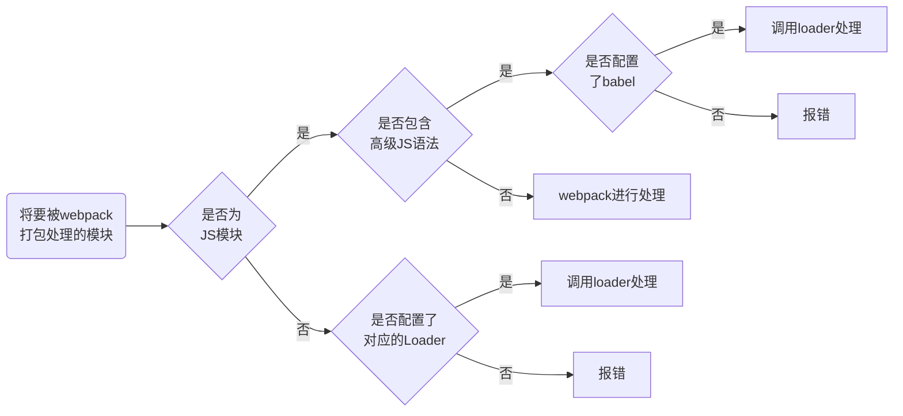

# JavaScript快速入门语法

## 一、基础语法

### 1.前言

作用：

* 表单验证
* 网页特效
* 服务端开发（Node.js）
* 桌面程序（Electron）
* App（Cordova）
* 控制硬件-物联网（Ruff）
* 游戏开发（cocos2d-js）

JavaScript组成：**ES**(ECMAScript)+**DOM**+**BOM**

书写位置：

1. 行内：在元素内部写
2. 内嵌：使用`<script>JS代码</script>` 标签
3. 外部：`*.js`文件，再通过`<script>` 标签引入`<script src="*.js"></script>`

### 2.基础语法

#### 2.1 注释

```js
//单行注释

/*
    多行注释
*/
```

#### 2.2 输入输出语句

|       方法       |              说明              |  归属  |
| :--------------: | :----------------------------: | :----: |
|    alert(msg)    |        浏览器弹出警告框        | 浏览器 |
| console.log(msg) |    浏览器控制台打印输出信息    | 浏览器 |
|   prompt(info)   | 浏览器弹出输入框，用户可以输入 | 浏览器 |

#### 2.3 变量

```js
// 声明变量
var age;
//变量赋值
age=18；
//变量的初始化
var age=18;
//会覆盖前面的值
age=20;
//声明多个变量
var age = 18,
      sex = 'man';
//只声明，不赋值
var sex;
console.log(sex);
> undefined
//不声明，直接使用
qq=120;
console.log(qq);
> 120
```

**命名规范：**

* 由字母、数字、下划线、美元符号组成
* 区分大小写
* 不能数字开头
* 不能是关键字
* 首字母小写的驼峰命名法

#### 2.4 数据类型

JS属于动态类型语言，根据右边变量值来判断数据类型。变量的数据类型**可变**。

**简单数据类型：**
| 数据类型  |           说明           |  默认值   |
| :-------: | :----------------------: | :-------: |
|  Number   | 数字型，包括整型和浮点型 |     0     |
|  Boolean  |          布尔型          |   false   |
|  String   |        字符串类型        |    ""     |
| Undefined |         未定义值         | undefined |
|   Null    |           空值           |   null    |

方法**isNaN()**，判断是否非数字，如果不是数字返回true

**字符串转义符：**
| 转义符 | 说明    |
| ------ | ------- |
| `\n`   | 换行    |
| `\\`   | 斜杠    |
| `\'`   | 单引号  |
| `\"`   | 双引号  |
| `\t`   | tab缩进 |
| `\b`   | 空格    |

数据类型检查函数：`typeof 变量名`

数据类型转化：

* 转化为字符串类型：`toString()`、`String()`
* 转化为数字类型：`pareInt()`、`parseFloat()`、`Number()`
* 转化为布尔型：`Boolean()`，只有''、0、NaN、null、undefined会被转化为false，其他都为true

#### 2.5 运算符

* 算术运算符：`+`、`-`、`*`、`/`、`%`
* 递增、递减运算符：`++`、`--`
* 比较运算符：`<`、`>`、`>=`、`<=`、`==`、`!=`、`===`和`!==` (全等，要求值和数据类型都一致)
* 逻辑运算符：`&&`、`||`、`!`
  * 逻辑与中断：`表达式1 && 表达式2` ，如果表达式1为真，返回表达式2，否则返回表达式1
  * 逻辑或中断：`表达式1 || 表达式2` ，如果表达式1为真，返回表达式1，否则返回表达式2
* 赋值运算符：`=`、`+=`、`-=`、`*=`、`/=`、`%=`

#### 2.6 流程控制

```js
//条件表达式为真，执行语句
if(条件表达式){
    //执行语句
}

if(条件表达式){
    //执行语句1
}else{
    //执行语句2
}

if(条件表达式1){
    //执行语句1
}else if(条件表达式2){
    //执行语句2
}else{
    //执行语句3
}

//三元表达式：条件表达式为真，返回表达式1，否则返回表达式2
条件表达式? 表达式1:表达式2

//表达式的值与value值进行匹配
switch(表达式){
    case value1:
        //执行语句1
        break;
    case value2:
        //执行语句2
        break;
    default:
        //最后语句
}
```

#### 2.7 循环控制

```js
//条件表达式为真，继续循环
for(初始化表达式;条件表达式;操作表达式){
    //循环体
}

//条件表达式为真，继续循环
while(条件表达式){
    //循环体
}

do{
    //循环体
}while(条件表达式)
```

* `continue`关键字，跳出本次循环，进入下一个循环
* `break`关键字，跳出当前循环

#### 2.8 数组

```js
//new创建数组
var arr=new Array();
var arr=new Array(1,2);

//数组字面量创建数组
var arr=[];
var arr=[1,2,'pink',true];

//访问数组
console.log(arr[0]);

//遍历数组
for(var i=0;i<arr.length;i++){
    console.log(arr[i]);
}

//添加元素
arr.length=10; //先修改数组长度，后添加
arr[4]='red';  //直接添加
arr='blue'  //arr会变成字符串
```

#### 2.9 函数

```js
//声明函数
function 函数名(){
    //函数体
}
//调用函数
函数名();

//有参函数
//声明函数
function 函数名(形参1,形参2,.....){
    //函数体
}
//调用函数
函数名(实参1,实参2,.....);

//函数表达式声明（匿名函数）
var 变量名=function(){
    //函数体
}
//调用函数
变量名();
```

* 参数数量不匹配
  * 实参=形参，正确
  * 实参>形参，取形参的个数
  * 实参<形参，多的参数定义为undefined，结果为NaN

* 返回参数：`return 返回值;`
* 接收参数不确定：用`arguments`来当形参接收数据
  * `arguments`是一个伪数组，具有数组的length属性，有索引，没有pop()、push()方法
* 内部访问外部变量，由内向外一层一层的查找。
* 预解析：js引擎会把所有的var和function提升到当前作用域最前面

#### 2.10 对象

```js
//创建字面量对象
var obj = {};
var obj={
    uname: '张三丰',
    age: 18,
    sex: 'man',
    sayHello: function(){
        console.log('Hello');
    }
}

//调用对象
console.log(obj.uname);
console.log(obj['uname']);
obj.sayHello();

//new Object创建对象
var obj=new Object();
obj.uname='张三丰';

//构造函数创建对象，建议名字首字母大写
function 构造函数名(){
    this.属性=值;
    this.方法=function(){}
}
new 构造函数名();

//遍历对象里面的属性和方法
for(变量 in 对象){
    //循环体
}
```

* js对象分为3种：自定义对象、内置对象、浏览器对象
* 查阅文档：[MDN](https://developer.mozilla.org/zh-CN/)
* `instanceof`运算符，检测是否为数组，`arr instanceof Array`
* `unshift()`方法在数组开头添加元素，`push()`方法向数组末尾添加元素
* `shift()`方法在数组开头删除元素，`pop()`方法向数组末尾删除元素
* 基本包装类型：把简单数据类型包装成复杂数据类型，使其能够使用属性和方法`var 变量=new String('内容')`
* 字符串不可变：在字符串重新赋值或者拼接的过程中，会重新开辟内存空间存储数据
* `indexOf('查找的字符',开始的位置)`，从开始的位置从前往后匹配字符，返回索引，找不到返回-1
* `lastIndexOf('查找的字符')`，从后往前匹配字符，返回索引（正常的索引）
* `charAt(索引)`，返回指定索引的字符
* `charCodeAt(索引)`，获取指定索引字符的ASCII码
* `str[索引]`，返回指定索引的字符
* `replace('被替换的字符','替换的字符')`，在字符串中查找被替换的字符替换成替换的字符
* `split('分隔符')`，根据分隔符将字符串转化为数组
* 简单数据类型传参传递的是结果，复杂数据类型传参传递的是地址

## 二、Web API

### 1.DOM

>文档对象模型（简称DOM），是W3C组织推荐的标准编程接口

* 文档：一个页面就是一个文档，DOM中使用document表示
* 元素：页面的所有标签都是元素，DOM中使用element表示
* 节点：网页中的所有内容都是节点，DOM中使用node表示

#### 1.1 获取元素

```js
//1.根据 ID 获取,返回DOM的Element对象，没有找到返回null
var 变量名=document.getElementById('ID名');

// 2. 根据标签名获取，得到所有标签对象的集合
var 变量名=document.getElementsByTagName('标签名');

//3. 通过HTML5新增方法获取
var 变量名=document.getElementsByClassName('类名'); 
var 变量名=document.querySelector('选择器'); //返回选择器的第一个对象

//4.特殊元素获取
var 变量名=document.body;  //获取body元素对象
var 变量名=document.documentElement; //获取html元素对象
```

#### 1.2 事件基础

* 事件源、事件类型、事件处理程序

```  js
var btn=document.getElementById('btn');
btn.onclick = function(){
    alert('hello');
}
```

#### 1.3 操作元素

* innerText属性，可读写元素内容
* innerHTML属性，可读写元素内容，识别HTML标签
* src、href属性，通过`对象.属性`的方式可读写元素相关内容
* id、alt、title属性，可读写元素相关内容
* 只要是元素的属性，都可以用`对象.属性`这个方法读写元素相关内容
* 通过`对象.style.属性名`来修改样式
* 通过`对象.className`修改元素的类名，以便修改更多的样式
* 上面的方法只能获得本来存在的属性，获得自定义属性使用`对象.getAttribute('属性名');`
* 设置自定义属性值：`对象.setAttribute('属性名',属性值);`
* 为了避免歧义，规定自定义属性命名规范：`data-自定义属性名`

#### 1.4 节点操作

* 作用：更简单的获取元素
* 节点构成：(节点类型)nodeType、(节点名称)nodeName、(节点值)nodeValue
* `对象.parentNode`，获取对象的父节点对象
* `对象.childNodes`，获取对象所有子节点对象，伪数组存储
* `对象.firstChild`，获取对象的第一个子节点对象
* `对象.lastChild`，获取对象的最后一个子节点对象
* `对象.firstElementChild`，获取对象的第一个子元素节点对象
* `对象.lastElementChild`，获取对象的最后一个子元素节点对象
* `对象.children[索引]`，获取对象的第索引个子元素节点对象
* `对象.nextSibling`，获取对象的下一个兄弟节点对象
* `对象.previousSibling`，获取对象的上一个兄弟节点对象
* `document.createElement('节点名')`，创建节点
* `对象.appendChild(节点对象)`，在对象下添加子节点
* `对象.removeChild(节点对象)`，删除对象下的子节点
* `对象.cloneNode()`，克隆一个节点，参数为空或者false为浅拷贝，为true为深拷贝

#### 1.5 事件高级

* 注册事件
  `eventTarget.addEventListener(type,listener,useCapture)`
  `eventTarget.addEventListener()`方法将监听器注册到eventTarget上，当该对象触发指定的事件时，就会执行事件处理函数。
  `type`：事件类型字符串，如click、mouseover，不需要带on
  `listener`：事件处理函数，事件发生调用该函数
  `useCapture`：可选参数、默认为false
* 删除事件
  `eventTarget.removeEventListener(type,listener,useCapture)`
* 事件流
  捕获阶段：从上往下检查事件是否注册，然后执行，useCapture=true
  冒泡阶段，从下往上检查事件是否注册，然后执行，useCapture=false
* 事件对象
  事件对象在注册事件就会存在，不需要传参自动创建，包含了事件相关信息

```js
var div  = document.querySelector('div');
div.onclick=function(event){
    console.log(event);
}
```

| 事件对象属性方法  |            说明            |
| :---------------: | :------------------------: |
|      target       |      返回触发事件对象      |
|       type        |       返回事件的类型       |
| preventDefault()  | 阻止默认事件，比如不让跳转 |
| stopPropagation() |          阻止冒泡          |

* 事件委托
  利用冒泡，给一个父节点添加事件，利用target属性，操作每一个子节点

|   鼠标事件    |     说明     |
| :-----------: | :----------: |
|    onclick    | 鼠标左键点击 |
|  onmouseover  |   鼠标经过   |
|  onmouseout   |   鼠标离开   |
|    onfocus    |   鼠标焦点   |
|    onblur     | 失去鼠标焦点 |
|  onmousemove  |   鼠标移动   |
|   onmouseup   |   鼠标弹起   |
|  onmousedown  |   鼠标按下   |
| oncontextmenu | 鼠标右键菜单 |
| onselectstart |   鼠标选中   |

| 键盘事件   | 说明                                |
| ---------- | ----------------------------------- |
| onkeyup    | 键盘松开                            |
| onkeydown  | 键盘按下                            |
| onkeypress | 键盘按下，不认识功能键ctrl、shift等 |

### 2.BOM

> 浏览器对象模型，它提供独立于内容而与浏览器窗口进行交互的对象，其最大的对象是window

#### 2.1 window对象常见事件

* 窗口加载事件

```js
//会让页面内容全部加载完成后，处理事件
window.onload=function(){}  //后面函数会覆盖前面的
window.addEventListener("load",function(){});  //不会覆盖，会同时存在
document.addEventListener('DOMContentLoaded',function(){})  //DOM加载完就可以执行了
```

* 窗口大小事件

```js
//调整窗口大小加载事件，当触发时就调用的处理函数
//利用这个事件完成响应式布局，window.innerWidth属性拿到当前的宽度
window.onresize=function(){}
window.addEventListener('resize',function(){});
```

#### 2.2 定时器

* `window.setTimeout(调用函数，[延迟的毫秒数]);`，该定时器在定时器到期后执行调用函数。
* `window.clearTimeout(timeoutID)`，取消setTimeout()建立的定时器，timeoutID为定时器的名字
* `window.setInterval(回调函数，[间隔的毫秒数])`，每隔一段时间调用一次回调函数
* `window.clearInterval(intervalID)`，停止setInterval()定时器

#### 2.3 JS执行队列

* 同步任务都在主线程执行
* 异步任务：所有的回调函数，都在消息队列中，等同步任务执行完再执行异步任务
  1. 普通事件，如click、resize
  2. 资源加载，如load、error
  3. 定时器，包括setInterval、setTimeout

#### 2.4 location对象

* 作用：获取或设置窗体的URL
* URL组成
  
| 组成     | 说明                         |
| -------- | ---------------------------- |
| protocol | 通信协议：http，ftp，matio等 |
| host     | 主机（域名）                 |
| port     | 端口号，可选                 |
| path     | 路径，由'/'隔开的字符串      |
| query    | 参数，键值对形式用&隔开      |
| fragment | 片段，#后面的内容            |

| location对象属性  | 返回值      |
| ----------------- | ----------- |
| location.href     | 返回整个URL |
| location.host     | 返回主机    |
| location.port     | 返回端口号  |
| location.pathname | 返回路径    |
| location.search   | 返回参数    |
| location.hash     | 返回片段    |

| location对象方法   | 返回值                       |
| ------------------ | ---------------------------- |
| location.assign()  | 跳转页面，记录浏览历史       |
| location.replace() | 替换当前页面，不记录浏览历史 |
| location.reload()  | 重新加载页面                 |

#### 2.5 navigator对象

* 包含浏览器信息、用户设备信息等的对象，主要用来区别PC端和移动端

#### 2.6 history对象

| history对象方法   | 返回值                    |
| ----------------- | ------------------------- |
| history.back()    | 页面后退                  |
| history.forward() | 页面前进                  |
| history.go(参数)  | 参数为1前进，参数为-1后退 |

### 3.网页特效

#### 3.1 元素偏移量offset系列

* 获得元素距离带有定位父元素的位置
* 获得元素自身的大小
* 返回数值没有单位，只读属性
* 常见属性

| offset系列属性 | 说明                                         |
| -------------- | -------------------------------------------- |
| offsetParent   | 返回该元素带有定位的父元素，如果没有返回body |
| offsetTop      | 返回元素相对带有定位父元素上方的偏移         |
| offsetLeft     | 返回元素相对带有定位父元素左边框的偏移       |
| offsetWidth    | 返回自身边框、内边距、内容的宽度             |
| offsetHeight   | 返回自身边框、内边距、内容的高度             |

#### 3.2 元素的可视区client系列

| client系列属性 | 说明                                 |
| -------------- | ------------------------------------ |
| clientTop      | 返回元素上边框的大小                 |
| clientLeft     | 返回元素左边框的大小                 |
| clientWidth    | 返回自身内边距、内容的宽度，不带单位 |
| clientHeight   | 返回自身内边距、内容的高度，不带单位 |

#### 3.2 元素滚动scroll系列

| scroll系列属性 | 说明                                     |
| -------------- | ---------------------------------------- |
| scrollTop      | 返回显示的内容上方与实际内容上方的距离   |
| scrollLeft     | 返回显示的内容下方与实际内容下方的距离   |
| scrollWidth    | 返回自身内边距和实际内容的宽度，不带单位 |
| scrollHeight   | 返回自身内边距和实际内容的高度，不带单位 |

#### 3.3 动画函数封装

* 原理：通过定时器不断移动盒子位置
* 步骤：
  1. 获得盒子当前的位置
  2. 让盒子在当前位置加上一个移动距离
  3. 加一个定时器不断重复这个操作
  4. 加一个结束定时器的条件
  5. 此元素需要添加定位，才能使用element.style.left

## 三、进阶语法

### 1.面向对象

面向过程（POP）：分析解决问题的步骤，用函数一步步实现并调用。

面向对象（OOP）：分析问题成一个个对象，让对象之间分工与合作。

面向对象的特性：

* 封装
* 继承
* 多态

#### 1.1 ES6的类和对象

> ES6是新一代的JS的语言规范

```js
//创建类
class Father{
    //构造函数，传递参数与返回实列对象，会默认创建，new命令会自动调用
    constructor(x,y){
        this.x=x;   //this指向当前对象
        this.y=y;
    }
    //添加方法
    say(){
        //方法体
        console.log('hello');
    }
}
//创建实列
var xx=new Father(1,2);    //先有类才能实列化，类的定义要在前面

//继承
class Son extends Father{
    constructor(x,y){
        super(x,y);   // 调用父类的构造函数，必须放在前面，之后再进行原本的构造函数
        //super.say();  调用父类方法
    }
}
var son = new Son(1,2); 
son.say();   //调用父类方法
```

#### 1.2 ES5构造函数和原型

> ES5没有类，需要使用构造函数和原型模拟类的效果

静态成员：在构造函数外，对构造函数的属性直接赋值的。不能实例化访问。
实例成员：在构造函数内定义的。只能实例化访问。

后面感觉重要了再补，略。。。。

#### 1.3 ES5新增方法

* 数组方法
  * forEach()
    * 功能：遍历数组
    * `array.forEach(function(currentValue,index,arr))`
    * currentValue：数组当前的值、index：数组当前索引、arr：数组对象本身
  * map()
  * filter()
    * 功能：检查数组中符合条件的所有元素，返回新数组
    * `array.filter(function(currentValue,index,arr))`
    * currentValue：数组当前的值、index：数组当前索引、arr：数组对象本身
  * some()
    * 功能：检查数组中是否有符合条件的元素，有返回true，否则返回false
    * `array.filter(function(currentValue,index,arr))`
    * currentValue：数组当前的值、index：数组当前索引、arr：数组对象本身
  * every()
* 字符串方法
  * trim()
    * 功能：会从一个字符串的两端删除空白字符，返回新的字符串。
    * `str.trim()`
* 对象方法
  * defineProperty()
    * 功能：定义对象中新属性或修改原有的属性。
    * `Object.defineProperty(obj,prop,descriptor)`
    * obj：目标对象、prop：需定义或修改的属性的名字、descriptor：目标属性所拥有的特性
    * 第三参数descriptor说明，以对象的形式{}书写：
      * value：设置属性的值，默认为underfined
      * writable：值是否可以重写，默认为false
      * enumerable：目标属性是否可以被枚举，默认为false
      * configurable：目标属性是否可以被删除或是否可以再次修改特性。默认false

#### 1.4 函数进阶

```js
//1. 自定义函数
function fn(){}
//2.函数表达式
var fun = function(){}
//3.利用new Function('参数1','参数2','函数体');
var f=new Function('a','b','console.log(a+b)');
```

更改this指向：

* call()
  * `对象.call(thisArg[,arg1,arg2,...])`
  * 可以修改对象中this指向对象thisArg。可以任意传递其他参数。
* apply()
  * `对象.apply(thisArg[,argsArray])`
  * 可以修改对象中this指向对象thisArg。想要传递参数必须为数组。
* bind()
  * `对象.bind(thisArg[,arg1,arg2,...])`
  * 该方法不会调用函数，会返回改造完的新函数。

严格模式：

1. 消除js语法的一些不合理地方
2. 消除代码的不安全地方
3. 提高编译器效率，增加运行速度
4. 为ES6做铺垫，禁用一些保留字：class等。

开启严格模式：在所有语句前添加`"use strict";`

严格模式的改变：

* 变量
  * 变量必须先声明再使用
  * 全局作用中函数中this是undefined
  * 定时器的this指向window
  * 事件和对象的this指向调用者
* 函数
  * 不能有重名的参数
  * 不允许在非函数的代码块内声明函数

高阶函数

* 以函数为参数的函数是高阶函数。

```js
function fn(callback){
    callback&&callback(); //调用函数
}
```

* 以函数为返回值的函数是高阶函数。

闭包：有权访问另一个函数作用域中变量的函数。

```js
function fn(){
    var num = 10;
    function fun(){  //闭包
        console.log(num);
    }
    return fun;
}
var f= fn();
f(); //外面作用域访问内部变量，延长局部变量的作用范围
```

递归函数：函数内部自己调用自己。

* 浅拷贝：只能拷贝一层数据，更深层次的数据只能拷贝引用。
  * `Object.assign(target,...sources)`
* 深拷贝：拷贝多层，每一级别都会拷贝。

#### 1.5 正则表达式

```js
//1.调用RegExp对象来创建正则表达式
var regexp=new RegExp(/123/)
//2.利用字面量创建正则表达式
var regexp=/123/;
console.log(regexp.test(123)); //判断内容是否符合正则表达式
```

* 边界符

| 符号 | 说明                           |
| ---- | ------------------------------ |
| ^    | 表示匹配行首的文本             |
| $    | 表示匹配行尾的文本             |
| []   | 表示任意匹配一次中括号内的文本 |
| [^]  | 表示取反，不匹配文本内容       |

* 量词符

| 符号  | 说明             |
| ----- | ---------------- |
| *     | 重复零次或更多次 |
| +     | 重复一次或更多次 |
| ？    | 重复零次或一次   |
| {n}   | 重复n次          |
| {n,}  | 重复n次或更多次  |
| {n,m} | 重复n到m次       |

* 预定义

| 符号 | 说明                             |
| ---- | -------------------------------- |
| \d   | 匹配0-9之间的任一数字            |
| \D   | 匹配0-9之外的字符                |
| \w   | 匹配任意字母、数字、下划线       |
| \W   | 匹配字母、数字、下划线之外的字符 |
| \s   | 匹配空格                         |
| \S   | 匹配非空格符                     |

`字符串.replace(正则表达式,要替换的字符串)`方法批量替换字符串。

switch修饰符：

* `/正则表达式/[switch]`
* g：全局匹配
* i：忽略大小写
* gi：全局匹配+忽略大小写

#### 1.6 ES6语法

* `let` 声明的变量具有块级作用域，具有暂时性死区（让块内变量与全局隔离）
* `const`声明常量时必须赋值，不能更改，具有块级作用域
* 解构赋值
  * `let [a,b,c] = [1,2,3];`  按照一一对应关系对从数组对变量赋值
  * `let {name,age}=person;` 按照属性从对象中进行匹配并赋值给变量
* `()=>{}` 箭头函数，类似匿名函数，但是没有自己的this
* 剩余参数`(参数1,...数组名)`，接收多余的参数
* 扩展运算符`...数组名`：可以将数组拆分成以逗号分隔的参数。
* `Array.from()`将可遍历的对象转化为数组
* `Array.find()` 找到第一个符合条件的数组成员，没有找到返回undefined
* `Array.findIndex()` 找到第一个符合条件的数组成员的索引，没有返回-1
* `数组.includes()` 查找数组是否包含值，返回布尔值
* 模板字符串
  * 使用` `` `符号，可以利用`${变量/函数}`添加字符串在字符串的任意位置
* `字符串.startsWith(字符串1)` 判断字符串头部是否有字符串1
* `字符串.endsWith(字符串1)` 判断字符串尾部是否有字符串1
* `字符串.repeat(n)`重复字符串n次，并返回新的字符串
* 参数默认值`function add(a,b=1){ return a+b;}`

**Set**集合，类似数组，但是成员唯一

* `let s =new Set();` `let s =new Set([1,2,3,4,4]);`
* `size`属性，返回集合的个数
* `add()`方法，增加元素
* `delete()`方法，删除元素，返回布尔值
* `has()`方法，检查是否包含某个元素，返回布尔值
* `clear()`方法，清空Set

**Map**键值对集合，键不限于字符串

* `let m=new Map();`
* `size`属性，返回集合的个数
* `set()`方法，增加元素
* `get()`方法，根据键返回值
* `clear()`方法，清空Map
* `has()`方法，检查是否包含某个元素，返回布尔值

**Symbol**数据类型
特点：

1. Symbol值唯一
2. Symbol不能与其他数据运算
3. Symbol定义对象属性不能使用for...in遍历

```js
//创建Symbol
let s = Symbol();
let s1 = Symbol('zs');
let s2 = Symbol.for('zs');

//安全向未知对象中添加新的方法
let game={};
let methods={
    up: Symbol(),
    down: Symbol()
};
game[methods.up]=function(){
    console.log('go to up');
}
game[methods.down]=function(){
    console.log('go to down');
}

//=================
let game={
    name: 'lrx',
    [Symbol('say')]: ()=>console.log('hello')
}
```

Symbol的内置属性，控制对象在特定场景中的表现

**迭代器**：*Iterator*主要提供给*for....of*

* *for.....in* 访问键(在对象中访问属性) ，*for....of* 访问值
* 工作原理：
  * 创建一个指针对象，指向当前数据结构的起始位置
  * 第一次调用next方法，指针自动指向第一个成员
  * 不断调用next方法，指针一直后移，直到指向最后一个成员
  * 每次调用next方法，返回一个包含value和done属性的对象

```js
const game={
    name: 'Night',
    arr: [
        'anight',
        'bnight',
        'cnight',
        'knight'
    ],
    [Symbol.iterator](){
        let index=0;
        let _this=this;
        return {
            next: ()=>{
                if(index<_this.arr.length){
                    const res={value: _this.arr[index],done: false};
                    index++;
                    return res;
                }else{
                    return {value: undefined,done: true};  //done为true说明到底了
                }
            }
        };
    }
}
```

**生成器**：是一种异步编程解决方案，是一种特殊函数
> 异步编程（文件操作、网络操作、数据库操作）--->纯回调函数

```js
//需求：1s 后输出111，2s后输出222，3s后输出333
function one(){
    setTimeout(()=>{
        console.log(111);
        iterator.next();
    },1000)
}
function two(){
    setTimeout(()=>{
        console.log(222);
        iterator.next();
    },2000)
}
function three(){
    setTimeout(()=>{
        console.log(333);
        iterator.next();
    },3000)
}
function *gen(){
    yield one();
    yield two();
    yield three();
}
let iterator = gen();
iterator.next();   //next里面可以传参，在yield位置接收
```

#### 1.7 异步编程

**JS是单线程的语言**

* 同步任务
  * 非耗时任务
  * 只有前面任务执行完成后，才能执行后面的任务
* 异步任务
  * 耗时任务，异步任务有JS的宿主环境执行
  * 当异步任务执行完成后，会通知JS主线程执行异步任务的回调函数

**Promise**

```js
const p = new Promise(function(resolve,reject){
    setTimeout(function(){
        // let data='数据库数据'
        // resolve(data)              //成功调用
        let err = '数据读取失败'
        reject(err)                        //失败调用
    },1000)
})
p.then(function(value){  //成功调用
    console.log(value)
},function(reason){   //失败调用
    console.log(reason)
})
```

**async/await**

用来简化Promise的异步操作

```js
async function getAllFile(){   // 存在 await的函数， 必须由 async 修饰
    // 会等待函数执行完成，而且await会把Promise对象中的结果拆解出来
    const r1 = await thenFs.readFile('./files/1.txt','utf-8');
    // await 之前的方法都会同步执行，当到达await方法后，会把await后面的代码都转到异步执行队列中
    const r2 = await thenFs.readFile('./files/1.txt','utf-8');
}
```

## 四、Webpack

前端工程化：把前端开发所需的工具、技术、流程、经验进行规范化、标准化。即：模块化、组件化、规范化、自动化。

### 1.基本使用

webpack是前端项目工程化的具体解决方案。

主要功能：代码压缩混淆、处理浏览器端JavaScript的兼容性、性能优化等功能。

```bash
# 在项目文件夹内初始化
npm init
# 安装
npm i webpack webpack-cli -D
```

在`package.json`文件中添加下面配置

```json
"scripts": {
    "dev": "webpack"
  },
```

在主目录新建`webpack.config.js`文件，添加下面内容

```js
module.exports={
    mode:'development',
}
```

```shell
# 运行
npm run dev
```

webpack会把js代码全部转化为兼容模式放在`./dist/main.js`文件中，后续只需要在html中导入该文件就行了。

### 2.进阶使用

#### 2.1 mode可选择值

1. development
   1. 开发环境
   2. 不会对打包生成文件进行代码压缩和性能优化
   3. 打包速度快，适合开发使用
2. production
   1. 生产环境
   2. 会对打包生成文件进行代码压缩和性能优化
   3. 打包速度慢，仅适合在项目发布阶段使用

#### 2.2 默认约定

1. 默认打包入口文件`src/index.js`
2. 默认输出文件路径`dist/main.js`
3. 自定义打包入口文件`entry: "文件路径"`
4. 自定义输出文件路径`output: { path: "文件路径", filename: "输出的文件名"}`

#### 2.3 插件

1. webpack-dev-server
   1. 类型nodemon工具
   2. 每当修改源码后，webpack都会自动进行项目的打包与构建
2. html-webpack-plugin
   1. 类似模板引擎
   2. 可以自定义index.html的内容

```shell
# 安装插件
npm i webpack-dev-server -D
```

在`package.json`文件中修改下面配置

```json
"scripts": {
    "dev": "webpack serve"
  },
```

```shell
# 安装插件
npm i html-webpack-plugin -D
```

在`webpack.config.js`中添加下面配置

```js
const HtmlWebpackPlugin = require('html-webpack-plugin');

const htmlPlugin = new HtmlWebpackPlugin({
    template: './src/index.html',
    filename: 'index.html',
});

module.exports={
    plugins: [htmlPlugin],
}
```

```shell
# 启动，html-webpack-plugin会把index.html复制到内存中，可以直接访问 http://localhost:8080/
npm run dev
```

为了解决每次打包完成都需要手动打开`http://localhost:8080/`地址，需要对`webpack.config.js`文件的节点进行额外的配置

```js
module.exports={
    devServer: {
        port: 8002,
        host: "127.0.0.1",
        open: true,
    },
}
```

#### 2.4 Loader加载器

webpack默认只处理js文件，如果需要处理其他文件需要loader加载器的作用



* 打包处理CSS文件

  ```shell
  # 安装css的loader
  npm i style-loader css-loader -D
  ```

  ```js
  // 向 webpack.config.js 文件添加内容
  module.exports={
      module: {
          rules: [
              {
                  test: /\.css$/, use: ['style-loader', 'css-loader']
              },
          ]
      }
  }
  ```

* 打包Less文件

  ```shell
  # 安装less的loader
  npm i less-loader less -D
  ```

  ```js
  // 向 webpack.config.js 文件添加内容
  module.exports={
      module: {
          rules: [
              {
                  test: /\.less$/, use: ['style-loader', 'css-loader', 'less-loader' ]
              },
          ]
      }
  }
  ```

* 打包url路径相关文件

  ```shell
  # 安装loader
  npm i url-loader file-loader -D
  ```

  ```js
  // 向 webpack.config.js 文件添加内容
  module.exports={
      module: {
          rules: [
              {
                  //test: /\.jpg|png|gif$/, use: 'url-loader' 
                  //test: /\.jpg|png|gif$/, use: 'url-loader?limit=222229' 限制图片大小，单位byte
                  test: /\.jpg|png|gif$/,
                  use: {
                    loader: 'url-loader',
                    options: {
                      limit: 222229,
                    },
                  },
              },
          ]
      }
  }
  ```

* 打包处理JS高级语法

  ```shell
  # 安装loader
  npm i babel-loader @babel/core @babel/plugin-proposal-class-properties -D
  ```

  ```js
  // 向 webpack.config.js 文件添加内容
  module.exports={
      module: {
          rules: [
              {
                  test: /\.js$/,
                  exclude: /node_modules/, //排除第三方库
                  use: {
                    loader: 'babel-loader',
                    options: {
                      plugins: ['@babel/plugin-proposal-class-properties']
                    },
                  },
              },
          ]
      }
  }
  ```

#### 2.5 打包发布

1. 开发环境下，打包生成的文件存放与内存中，无法获取到最终打包生成的文件
2. 开发环境下，没有对代码进行压缩和性能优化

在`package.json`文件的script节点下添加build命令：

```json
 "script": {
   "build": "webpack --mode production"
 }
```

在`webpack.config.js`对打包路径进行配置

```js
module.exports={
    output: {
        path: './dist',
        filename: 'js/bundle.js',
    },
    module: {
        rules: [
            {
                test: /\.jpg|png|gif$/,
                use: {
                    loader: 'url-loader',
                    options: {
                        limit: 10240,
                        outputPath: 'images/'
                    }
                }
            },
        ]
    }
}
```

清除旧文件插件

```shell
# 安装插件
npm i clean-webpack-plugin -D
```

在`webpack.config.js`配置插件

```js
const {CleanWebpackPlugin} = require('clean-webpack-plugin');

const cleanPlugin = new CleanWebpackPlugin();

module.exports={
  plugins: [htmlPlugin,cleanPlugin],
}
```

在`webpack.config.js`配置Source Map来在调试中查找错误文件

1. 开发环境
   1. 把devtool的值设置为eval-source-map
   2. 可以定位到错误行
2. 生产环境
   1. 关闭source map，将devtool值设置为nosources-source-map
   2. 提高网站安全性
